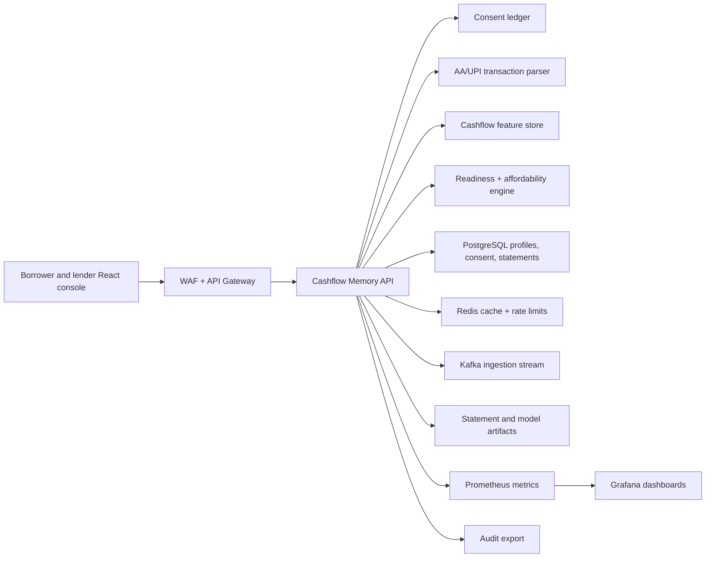
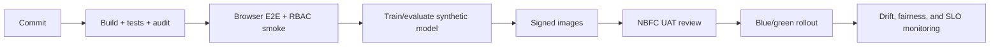

# Enterprise Cloud Deployment

Author: Prashant Jagtap <jprbom@gmail.com>

This repository is a runnable portfolio MVP today. The enterprise target is a consent-based cashflow intelligence platform for thin-file merchants, NBFCs, and fintech lenders. It turns UPI or Account Aggregator-like transaction history into explainable credit-readiness evidence, not an opaque lending decision.

## Reference Architecture



## Cloud Mapping

| Layer | AWS | Azure | GCP |
| --- | --- | --- | --- |
| Frontend/API | CloudFront + EKS/ECS | Front Door + AKS/Container Apps | Cloud CDN + GKE/Cloud Run |
| Database | RDS PostgreSQL | Azure PostgreSQL | Cloud SQL |
| Queue | MSK/SQS | Event Hubs/Service Bus | Pub/Sub |
| Artifacts | S3 | Blob Storage | Cloud Storage |
| Secrets | Secrets Manager/KMS | Key Vault | Secret Manager/KMS |
| Monitoring | CloudWatch/Grafana | Azure Monitor/Grafana | Cloud Monitoring |

## Production Cashflow Differentiators

- AA-style consent lifecycle with grant, expiry, revocation, and purpose binding.
- Monthly cashflow memory: inflow stability, payer concentration, supplier regularity, seasonality, and shortfall proxies.
- Responsible-lending explanation for lender and borrower views.
- Safe working-capital simulation with reason codes and adverse-action explanations.
- Fairness and bias dashboard by geography, merchant category, income volatility, and business vintage.

## Required Variables

```text
NODE_ENV=production
PORT=4103
CORS_ORIGIN=https://cashflow-memory.example.com
DATABASE_URL=postgresql://...
REDIS_URL=redis://...
KAFKA_BROKERS=broker-1:9092
OIDC_ISSUER=https://issuer.example.com
OIDC_AUDIENCE=cashflow-memory-api
STATEMENT_BUCKET=cashflow-memory-artifacts
```

## Security and Compliance

The current app uses synthetic records and demo RBAC. Enterprise deployment must enforce OIDC/JWT, consent receipts, tenant isolation, encrypted statement storage, field-level PII classification, immutable audit logs, and clear data retention windows.

## Data Model Target

```text
tenants, users, roles, permissions
merchant_profiles, consent_grants, consent_events
bank_statements, transactions, cashflow_features
credit_readiness_scores, affordability_assessments
decision_reason_codes, model_versions, model_predictions
human_reviews, audit_logs
```

## Deployment Flow



## Observability

Operational endpoints:

- `GET /api/live`
- `GET /api/ready`
- `GET /api/metrics/prometheus`

Dashboards should track ingestion latency, parsing failure rate, score distribution, consent expiry, user revocation, fairness drift, override rate, API latency, and audit export success.

## Enterprise Readiness Checklist

- Replace JSON files with PostgreSQL migrations.
- Add AA-style statement upload/parse and consent receipt APIs.
- Add model metrics, calibration, model card, and adverse-action policy.
- Run E2E in CI and store artifacts.
- Add backup/restore, retention, PII classification, and deletion workflows.
